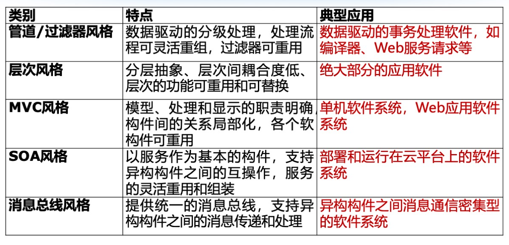
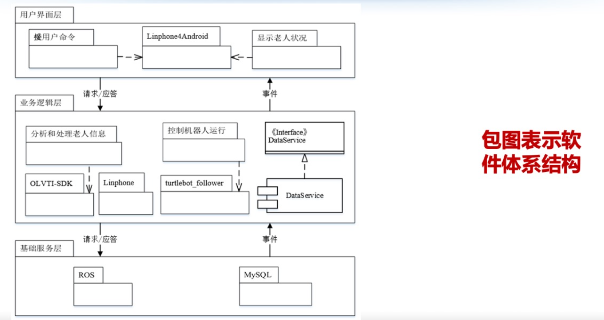

> 基于功能性和非功能性软件需求，寻求体系结构风格，给出初步和粗糙的顶层结构，无需关注架构各个及系统或构件内部的实现细节。用UML中的包图对所设计的顶层架构进行直观的表示。
> 评价体系结构设计：
### 一、文档概述
#### 1.1 编写目的
#### 1.2 文档范围
#### 1.3 目标读者
#### 1.4 术语定义
#### 1.5 参考资料

### 二、系统概述
#### 2.1 业务背景
#### 2.2 系统功能
LevelUP系统的核心功能包括：
### 三、设计目标和原则
#### 3.1 总体设计目标
- 性能
- 安全性
- 可扩展性
- 可用性
- 可维护性
- 易用性
#### 3.2 架构设计原则
- **高内聚低耦合**：各模块功能独立、职责明确，减少模块间的直接依赖。
- **关注点分离**：将业务逻辑、数据访问、用户界面等不同职责清晰地划分到不同层次或模块。
- **可配置与可定制**：特别是Roadmap部分，应允许用户高度自定义。
- **数据驱动**：充分利用数据（笔记内容、元信息、用户行为）来驱动推荐和图谱生成。
- **安全性优先**：从设计层面考虑数据加密、身份验证和授权。
- **伸缩性设计**：考虑未来用户量和数据量的增长，支持水平扩展。
### 四、设计约束和现实限制
#### 4.1 技术约束
- 必须兼容Markdown语法。
- Roadmap编辑支持实时渲染。
- 需要支持全文搜索。
- 需要支持图谱可视化。
#### 4.2 业务约束
- 用户数据的隐私保护和安全存储。
- 系统需满足个性化学习的需求。
#### 4.3 资源与时间约束
- 项目成员有限
- 大作业项目周期限制
- 目前项目成员技术能力有限
#### 4.4 外部依赖
- **Markdown编辑器**：如ReactMarkdown。
- **图可视化库**：用于知识图谱的可视化。
- **全文搜索数据库/引擎**：如Meilisearch或DocSearch（适配Markdown）。
### 五、逻辑观点的体系结构设计
> 将系统功能分解为逻辑模块，并定义其职责和协作关系。
#### 5.1 架构设计与模式
微服务架构与分层架构相结合
#### 5.2 核心业务模块
系统逻辑上划分为以下主要服务/模块：
1. **用户与认证服务 (User & Auth Service)**
    - **职责**：用户注册、登录、身份认证、权限管理、用户个人信息管理。
    - **协作**：
2. **Roadmap管理服务 (Roadmap Service)**
    - **职责**：创建、编辑、存储、加载Roadmap数据（JSON结构），处理Roadmap节点状态（点亮、进度计算），提供Roadmap共享功能。
    - **协作**：与笔记服务关联文件，与推荐服务获取相关前置/后置技能推荐。
3. **笔记管理服务 (Note Service)**
    - **职责**：Markdown笔记的存储、加载、版本管理、分类与关联，笔记元信息（摘要、知识点、难度、前置依赖）管理。
    - **协作**：向全文搜索服务同步笔记内容，向知识图谱服务提供笔记元数据。
4. **搜索与推荐服务 (Search & Recommendation Service)**
    - **职责**：处理用户搜索请求（关键词匹配、模糊匹配、语义相似度计算），根据用户行为、笔记关联度、知识图谱信息提供笔记、学习方向、相关资料的智能推荐。
    - **协作**：从笔记服务获取笔记内容进行索引，从知识图谱服务获取知识点关联信息。
5. **文件存储服务 (File Storage Service)**
    - **职责**：安全存储用户上传的Markdown文件及其他附件（如PDF），管理文件版本。
    - **协作**：为笔记服务提供文件读写接口。
***此处有一张逻辑视图（C4模型）***
#### 5.3 关键抽象与实体
#### 5.4 关键功能流与协作
#### 5.5 接口设计
- **API Gateway**：统一对外暴露RESTful API，进行认证、路由和限流。
- **用户与认证服务 API**：
    - `POST /auth/register` (用户注册)
    - `POST /auth/login` (用户登录，返回JWT Token)
    - `GET /users/{id}` (获取用户信息)
- **Roadmap管理服务 API**：
    - `POST /roadmaps` (创建Roadmap)
    - `GET /roadmaps/{id}` (获取Roadmap详情)
    - `PUT /roadmaps/{id}/nodes/{nodeId}/status` (更新节点状态)
    - `GET /roadmaps/shared` (获取社区共享Roadmap列表)
- **笔记管理服务 API**：
    - `POST /notes` (创建笔记，上传Markdown文件)
    - `GET /notes/{id}` (获取笔记内容)
    - `PUT /notes/{id}` (更新笔记)
    - `DELETE /notes/{id}` (删除笔记)
    - `GET /notes/search?keyword={keyword}` (搜索笔记，转发给搜索服务）
- **知识图谱服务 API**：
    - `GET /graph/user/{userId}` (获取用户知识图谱数据)
    - `GET /graph/note/{noteId}/related` (获取某笔记关联图谱片段)
- **搜索与推荐服务 API**：
    - `GET /search?q={query}` (全文搜索)
    - `GET /recommendations/notes?userId={userId}` (推荐笔记)
    - `GET /recommendations/roadmaps?userId={userId}` (推荐Roadmap)
### 六、部署观点的体系结构设计
> 描述系统组件在物理硬件上的部署

### 七、开发观点的体系结构设计
> 指导开发团队如何组织和管理代码
#### 7.1 目录结构
#### 7.2 技术栈
#### 7.3 开发环境配置与工具链
- **IDE**：
- **包管理**：
- **代码质量**：
- **测试框架**：
### 八、运行观点的体系结构设计
> 描述系统运行时进程、线程的并发行为和交互
### 九、总结

